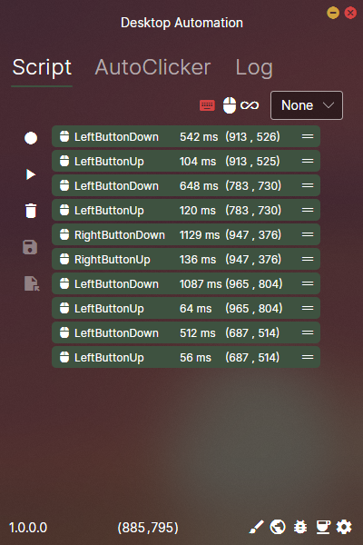
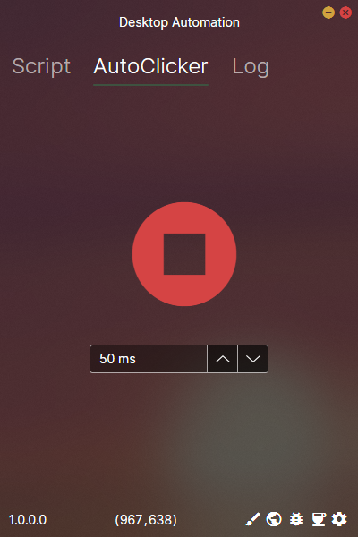

<div align="center">
  


  

Keyboard and mouse automation tool :hammer_and_wrench:

[Installation](#installation-frog) •
[Roadmap](#roadmap-world_map) •
[FAQ](#faq-question) •
[Support](#support-love_letter)



</div>

## Installation :frog:

Download the release
### Build :hammer:
```
dotnet build
```
    
## Roadmap :world_map:
- Save and load recordings :floppy_disk:
- Draw mouse clicks :art:
- Settings :gear:


## FAQ :question:

#### Question 1

Answer 1

#### Question 2

Answer 2


## Support :love_letter:

Submit an issue!

